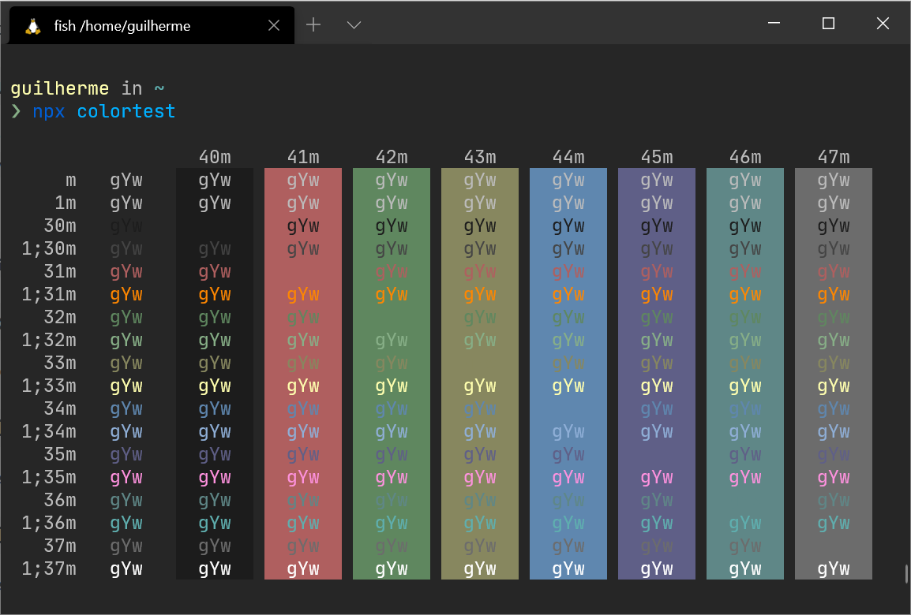

<p align="center">
   
</p>

# apprentice-windows-terminal

[](https://github.com/guilhermedeandrade)

<br />

## :pushpin: Table of Contents

- [Introduction](#scroll-introduction)
- [Installation](#construction_worker-installation)
- [Getting Started](#runner-getting-started)
- [Acknowledgments](#pray-acknowledgments)

## :scroll: Introduction

A port of Romain Lafourcade's
[Apprentice](https://github.com/romainl/Apprentice) colorscheme for [Windows Terminal](https://github.com/Microsoft/Terminal).

## :construction_worker: Installation

**Setup**

Start Windows Terminal and click on the down arrow symbol `K` from menu bar. This will open a drop down menu from which select Settings option. Alternatively use `Ctrl + ,` to open Settings directly.

In the `settings.json` settings file for Windows Terminal, find the schemes section and paste the content of `apprentice.json`.

```json
"schemes": [
  {
    "name" : "Apprentice",
    "background" : "#262626",
    "black" : "#1C1C1C",
    "blue" : "#5F87AF",
    "cyan" : "#5F8787",
    "foreground" : "#BCBCBC",
    "green" : "#5F875F",
    "purple" : "#5F5F87",
    "red" : "#AF5F5F",
    "white" : "#6C6C6C",
    "yellow" : "#87875F",
    "brightBlack" : "#444444",
    "brightBlue" : "#8FAFD7",
    "brightCyan" : "#5FAFAF",
    "brightGreen" : "#87AF87",
    "brightPurple" : "#FF92DF",
    "brightRed" : "#FF8700",
    "brightWhite" : "#FFFFFF",
    "brightYellow" : "#FFFFAF"
  }
]
```

## :runner: Getting Started

**Activation**

```json
"profiles": {
  "defaults": {
      "colorScheme" : "Apprentice"
  }
}
```

## :pray: Acknowledgments

Thanks to [Romain Lafourcade's](https://github.com/romainl) for creating the [Apprentice](https://github.com/romainl/Apprentice) theme.
